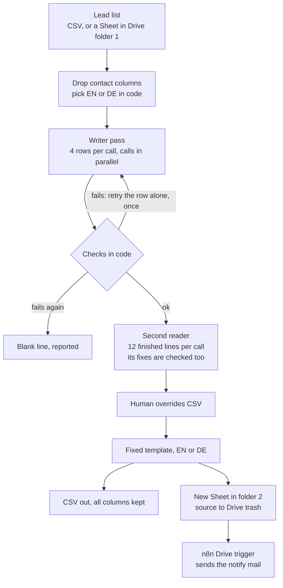

# lead-icebreakers

Personal first lines for cold email, where the model never writes the sentence.

A lead list (CSV or Google Sheet) goes in. Every row gets an `Icebreaker` column built from a
fixed sentence. A model fills only two slots: the lead's casual first name and the company name
the way people say it. A second, independent model pass reads every finished line as the
recipient would and fixes names that sound off. A human overrides file beats both passes.

This is a sanitized version of a system I run in production for my agency, YCAT
([youcanautomatethis.com](https://youcanautomatethis.com)). Real leads, accounts and ids are
removed, and every lead in this repo is fictional.

## The problem

Cold email needs a personal first line, and both usual ways to get one go wrong:

- Writing them by hand does not scale past a few dozen leads.
- Letting a model write them freely gives you invented compliments ("loved your recent post
  on..."), a different tone in every email, and a thousand lines nobody checked before sending.

## What it does

The sentence is written once by a person and lives in `config/templates.toml`:

```text
EN  Hey {nick}. Came across {company} the other week and really like what you're building.
DE  Hey {nick}. Bin neulich auf {company} gestoßen und finde richtig gut, was ihr aufbaut.
```

The model decides only what needs judgment:

| Slot | Rule | From the demo data |
|---|---|---|
| `{nick}` | the name colleagues use; no invented nicknames; the lead's own spelling | MAXIMILIAN -> Max, José stays José |
| `{company}` | the short brand as people say it, or "your *what they do* business" when the name would sound odd in the line | Hafenblick Digital GmbH & Co. KG -> Hafenblick; Example Consulting (Jane Example's own firm) -> your consulting business; Emma Solutions -> your software business |

Language is decided in code: Germany, Austria, Liechtenstein and German-speaking Swiss cities
get the German line, with Swiss spelling (ss instead of ß) in Switzerland. Only a Swiss city
that is not in the lookup, like bilingual Fribourg, is left to the model.

Around that:

- **Writer pass.** Rows go to the model in small batches (4 rows per call, up to 6 calls in
  parallel) with a JSON schema, so every answer is structured.
- **Checks in code.** Every answer is validated before it can reach a line: no legal form left
  in ("GmbH"), no taglines or long dashes, generic phrases must start with "your" (or
  "dein..." in German) and must not be vague ("your company"). A failing row is retried once
  on its own. A row that still fails is left blank and reported, never guessed.
- **Second reader.** A separate pass gets every finished line (12 per call) and checks it as the
  recipient would read it. It returns the final words plus a reason for each change, and its
  fixes go through the same checks.
- **Human overrides.** `config/overrides.csv` holds one row per company you have ruled on,
  matched by domain or company name. It beats both model passes on every run, and `reapply`
  pushes new rulings into a finished file without any model call.
- **Contact data stays local.** Email, phone, LinkedIn, address and id columns are dropped
  before the prompt is built, and a value check drops anything in other columns that looks like
  an email address, phone number or profile link. The output file keeps every original column.
- **Backends.** The Anthropic API (`ANTHROPIC_API_KEY`), the `claude -p` CLI on a logged-in
  Claude subscription, or an offline mock for the demo and the tests.
- **Optional Google Drive hand-off.** A list dropped in folder 1 becomes a new enriched Sheet in
  folder 2, the source goes to the Drive trash, and an n8n workflow watching folder 2 sends the
  notification mail.

## Architecture



## Quickstart: offline demo, no key

```bash
git clone <this repo> && cd lead-icebreakers
python3 demo.py        # or: make demo
```

Python 3.11 or newer, standard library only. The demo runs the real pipeline on 12 fictional
leads in `fixtures/sample_leads.csv`. Only the model is replaced, by canned answers from
`fixtures/mock_answers.json`. Four of the canned writer answers are wrong on purpose, so you
can see what the second reader is for. (In one real run of the `claude -p` backend on the same
file, the writer got all four right by itself and the second reader changed nothing.)

Actual output, the long finished lines shortened to four:

```text
lead-icebreakers demo: offline, mock backend, no API key

input      fixtures/sample_leads.csv  (12 fictional leads, 11 columns)
overrides  config/overrides.example.csv  (2 human rulings)

  backend mock: 12 rows to write, 0 skipped
  writer pass: 12 rows in 3 calls of up to 4 rows, up to 6 at a time
  review pass: 12 lines in 1 call of up to 12 lines, up to 6 at a time

Before -> after  (row = spreadsheet row, the header is row 1)

row  first_name   company_name                      nick      company words                   language
  2  Michael      Brightpath Analytics Ltd          Mike      Brightpath                      en, by country
  3  Jane         Example Consulting                Jane      your consulting business        en, by country
  4  MAXIMILIAN   Hafenblick Digital GmbH & Co. KG  Max       Hafenblick                      de, by country
  5  Lukas        Online Marketing                  Lukas     dein Online-Marketing-Business  de, by country
  6  José         Northwind IT Services S.L.        José      Northwind                       en, by country
  7  Sophie       The Framework                     Sophie    your design business            en, by country
  8  Ursula       Grünwerk Studio AG                Ursula    Grünwerk Studio                 de, by Swiss city
  9  Camille      Lumen Conseil SA                  Camille   Lumen                           en, model decided
 10  Olivia       Emma Solutions Ltd                Olivia    your software business          en, by country
 11  Daniel       IT Services & Consulting          Daniel    deine IT-Beratung               de, by country
 12  Christopher  CLOUDRIDGE AG                     Chris     CloudRidge                      de, by Swiss city
 13  Anna         Tradeloop Commerce Solutions BV   Anna      Tradeloop                       en, by country

Second reader changed 4 of 12 lines
  row 3   Jane / Example Consulting  ->  Jane / your consulting business
          company is named after the lead
  row 6   Jose / Northwind  ->  José / Northwind
          keep the accent the lead uses
  row 10  Olivia / Emma  ->  Olivia / your software business
          "Emma" reads like a first name in the line
  row 13  Anna / Tradeloop Commerce  ->  Anna / Tradeloop
          second word is not part of the name people use

Human overrides changed 1 line (applied after both model passes)
  row 12  Chris / Cloudridge  ->  Chris / CloudRidge
          the brand writes it CloudRidge

Finished lines
  row 3   Hey Jane. Came across your consulting business the other week and really like what you're building.
  row 4   Hey Max. Bin neulich auf Hafenblick gestoßen und finde richtig gut, was ihr aufbaut.
  row 8   Hey Ursula. Bin neulich auf Grünwerk Studio gestossen und finde richtig gut, was ihr aufbaut.
  row 13  Hey Anna. Came across Tradeloop the other week and really like what you're building.

What the model saw
  columns  first_name, last_name, title, company_name, company_domain, industry, city, country (+ lang_hint)
  never    email, phone, linkedin_url  (the mock raises if contact data reaches it)
  calls    3 writer calls of 4/4/4 rows run in parallel, 1 reviewer call of 12 lines

wrote out/sample_leads-icebreakers.csv  (12 written, 0 skipped, 0 failed; all 11 input columns kept)
```

Tests (offline, a fake backend and an in-memory fake of Google Drive):

```bash
pip install -r requirements-dev.txt
make test
```

## Real mode

```bash
pip install -r requirements.txt
cp .env.example .env      # add ANTHROPIC_API_KEY, or leave it empty and log in to the claude CLI
python icebreakers.py leads.csv                       # writes leads-icebreakers.csv
python icebreakers.py leads.csv --limit 8             # quick test on the first 8 rows
python icebreakers.py reapply leads-icebreakers.csv   # apply new overrides, no model calls
```

The CSV needs a first-name column and a company column; common header spellings are recognised
(`first_name`, `First Name`, `company_name`, `Company`, ...). A country column picks the
language, a city column settles Swiss leads, and a domain column helps overrides match. Rows that
already have an icebreaker are skipped unless you pass `--overwrite`.

Options: `--backend auto|api|cli|mock` (auto = API when a key is set, else the CLI; never the
mock), `--workers`, `--batch-size`, `--review-batch`, `--overrides PATH`, and `--no-review` for
quick tests. The model and effort come from `ICEBREAKERS_MODEL` and `ICEBREAKERS_EFFORT`
(defaults `claude-opus-5-5` and `medium`). The exit code is 1 when any row failed, so a
scheduler can alert on it.

### Google Drive hand-off (optional)

1. `pip install -r requirements-drive.txt`
2. Create a Google Cloud OAuth client (desktop app), enable the Drive and Sheets APIs, and get a
   refresh token for the account that owns both folders (scopes `drive` and `spreadsheets`).
   Put the client id, secret and refresh token in `.env`, plus the two folder ids and
   `GOOGLE_EXPECTED_ACCOUNT`, which makes the script refuse any other Google account.
3. Import `n8n/notify-enriched-list.json` into n8n, pick your Google Drive and Gmail
   credentials, set folder 2's id and your address, and activate it.

```bash
python icebreakers.py drive --list                         # what is waiting in folder 1
python icebreakers.py drive --file-id <id> --dry-run       # local copy only, Drive untouched
python icebreakers.py drive --file-id <id>                 # one list end to end
python icebreakers.py drive --all                          # every Sheet in folder 1
python icebreakers.py drive --redo <id> --overrides-only   # new rulings into a finished Sheet, same link
python icebreakers.py drive --sweep                        # clear folder 1 of lists already enriched
```

A local copy of every enriched list and its change report land in `out/enriched/`.

## Project layout

```text
icebreakers.py               CLI: CSV in, CSV out (plus the reapply and drive commands)
demo.py                      offline demo on the fictional sample
config/
  templates.toml             the fixed EN and DE sentences, generic-phrase rules
  rules.md                   naming rules, sent to both model passes
  overrides.example.csv      fictional human rulings (yours go in overrides.csv, gitignored)
lead_icebreakers/
  pipeline.py                writer pass, second reader, retries, overrides, rendering
  prompts.py                 per-row payload, system prompts, JSON schemas
  template.py                fill the sentence, parse it back, check slot values
  language.py                EN or DE by country and Swiss city
  leads.py                   column aliases, contact-data detection
  overrides.py               human rulings, reapply without a model
  drive.py                   optional Google Drive hand-off
  backends/                  anthropic_api.py, claude_cli.py, mock.py
  cli.py, csvio.py, config.py
fixtures/                    sample_leads.csv (fictional), mock_answers.json (canned answers)
n8n/notify-enriched-list.json   Drive trigger -> IF -> Gmail notify workflow
tests/                       pytest, all offline
```

## Design decisions

### Why a fixed template

- **Consistency.** Every lead gets the same sentence, in the same tone, approved once by a
  person. Reading one line tells you what all of them say.
- **No hallucinated personalization.** The model never writes a claim about the recipient. It
  cannot invent a funding round, a post they never wrote, or a product they do not sell. Its
  whole job is two short slot values, and code checks both.
- **Legal and brand safety.** What goes out is exactly what a person signed off, plus a first
  name and a company name. Nothing the model makes up reaches a prospect. And since the model
  never receives contact details, they cannot leak into a line or sit in a provider's request
  logs.

### Code decides everything that needs no judgment

The sentence, the language (except ambiguous Swiss cities), Swiss spelling and every check are
plain code. The model is asked only for what code cannot know: that "Emma" reads like a first
name in the line, or that Jane Example's "Example Consulting" is named after her.

### A second reader instead of a longer prompt

The writer sees raw lead data. The second reader sees the finished sentence, which is where an
odd name shows ("Came across Emma the other week"). A reviewer fix that breaks a rule is
rejected and the writer's version kept. If a reviewer call fails twice, its rows ship blank: no
line goes out without a second read.

### Humans have the last word

Borderline names can come out differently between runs. The overrides file settles a company
once, for every future list. Because the sentence is fixed, a finished line can be parsed back
into its slots, so `reapply` (or `drive --redo --overrides-only`) updates a finished file without
a model call and without touching any other line.

### Fail closed

A row that fails twice is left blank, named in the report, and the exit code is 1. In Drive mode
nothing is uploaded and the source stays in folder 1 unless you pass `--allow-partial`.

### Created, not moved

n8n's Google Drive trigger fires on a file's creation time. A file moved into folder 2 keeps its
old timestamp and would never trigger the notify mail, so the hand-off creates a new Sheet
there, reads it back, and only then moves the source to the trash.

### The mock sees exactly what a model would see

The mock backend gets the same system prompt, schema and prompt text as a real model and reads
the rows out of the prompt. It raises if contact data ever reaches it, so the demo and the
tests double as a check on the privacy rule.

## Limitations

- The demo's model answers are canned. They show the pipeline, not model quality. In mock mode,
  rows outside the sample get a crude rule-based guess.
- The line is generic by design. It says nothing specific about the lead; that is the trade for
  never being wrong about them.
- English and German only. Another language needs a template in `templates.toml` and a rule in
  `language.py`.
- Borderline names can flip between runs. The change report and the overrides file are where a
  person settles them.
- The Drive hand-off is tested against an in-memory fake of the Drive and Sheets APIs, not
  against a live account. You need your own OAuth client, and an n8n instance for the notify.
- `--backend cli` depends on flags of a current Claude Code CLI (`--json-schema`,
  `--system-prompt`, `--tools`).
- There is no pacing beyond the Anthropic SDK's own retries; keep `--workers` modest on low rate
  limits.

## License

MIT, see [LICENSE](LICENSE).
